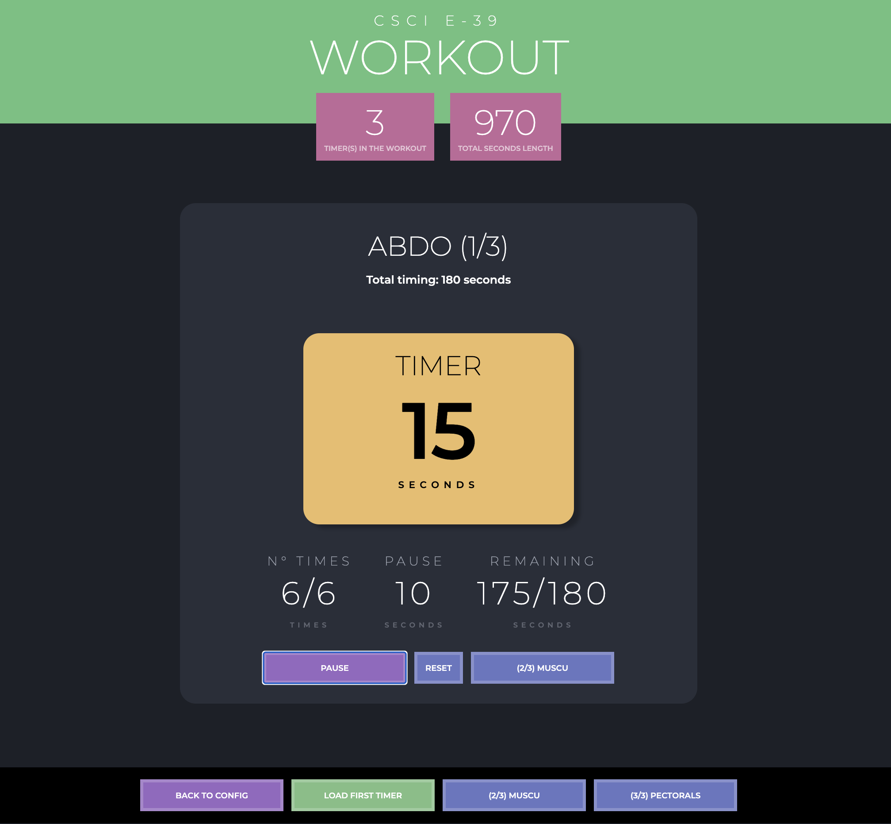

# URL

TO DO

## Install

npm i react-router-dom
npm i styled-components

### `npm start`

Runs the app in the development mode.\
Open [http://localhost:3000](http://localhost:3000) to view it in your browser.

# Objective for Assignment 2

You can:
- give a title
- decide the duration
- number of repeats
- and pause time between each exercise
(fields can be left blank)

On the home page, 
- you can add, edit or delete a timer
- if at least 1 timer exists, you can start the workout
- you can see the number of workouts and the total duration in the Header

On the workout page, we display the title of the active exercise, its duration, the number of repetitions and the number of pauses, if any.
- you can access the next workout via the menu at the bottom, or wait until the end of the exercise to move on to the next one

